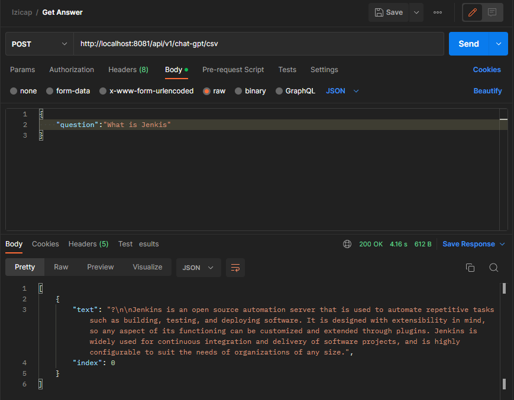
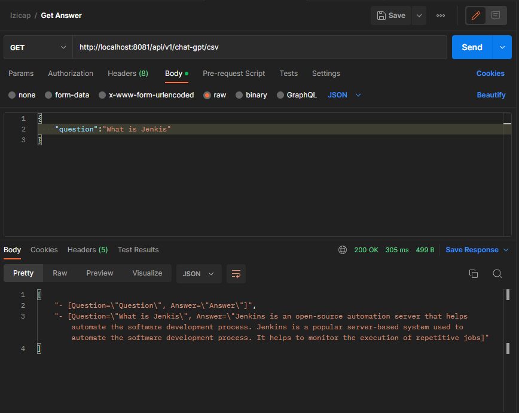

# ChatWithChatGPT

The objective of this project is building a microservice which will query the ChatGPT API using input string by
the user to generate responses to the questions and saving them.

# Description

The code contains a single Controller named "ChatGPTController" ready for POST, it returns a method from the class ChatGptService.getAnswer() that treats the input and contact OpenAI API. Also there are 2 additionnal methods for writing and reading the answers from a CSV file.

# Requirements

          - Springboot3

          - Java 17

          - Maven

          - Docker

# Usage

          1- Starting by cloning the repo : https://github.com/Kawtarfahmy/ChatWithChatGPT

          2- Using the command : cd eureka-discovery to redirect to eureka

          3- We run the clean lifecycle, which is made out of the plugin goal clean:clean and which takes care of cleaning the project.
             We then run install . What this does is run the build phases of the default lifecycle and for each build phase all the plugin goals they contain are executed. 

                   mvn clean install

          4- Using the command : cd ../openai to redirect to openai

          5- In the same way we will use the command : mvn clean install

          6- Using the command : cd .. to redirect to the main folder

          7- Using the command : docker-compose up -d to run the entire application

          8- Using the command : docker-compose down to delete or shutdown all the containers created with docker-compose file

# Simulation

          -> GET Method : Allows you to retrieve the response and display it.
              
               http://localhost:8081/api/v1/chat-gpt

          -> POST Method : Allows to save the answer in a csv file.

               http://localhost:8081/api/v1/chat-gpt/csv

          -> GET Method : this GET Method allows you to read the response from csv file. 

               http://localhost:8081/api/v1/chat-gpt/csv

